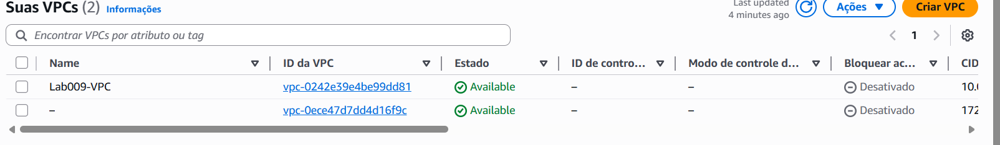
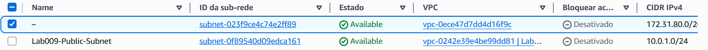
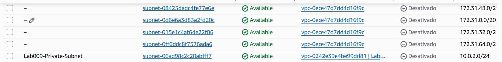
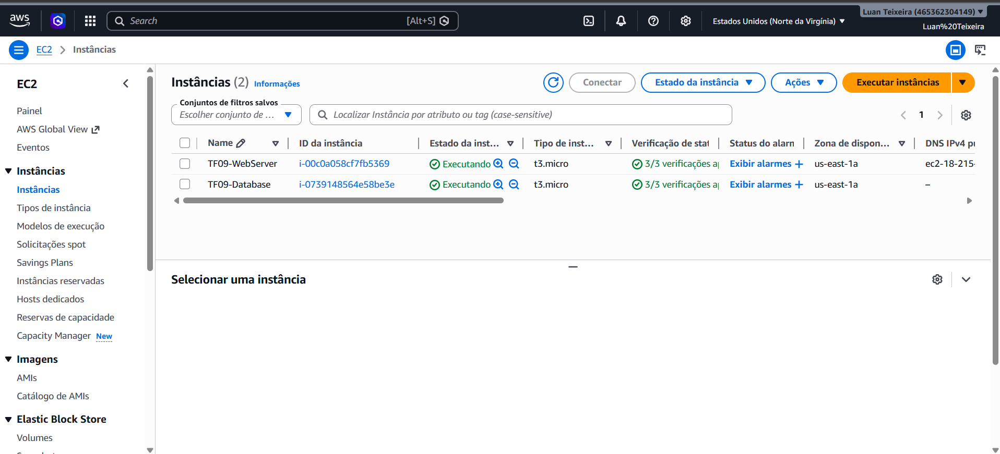
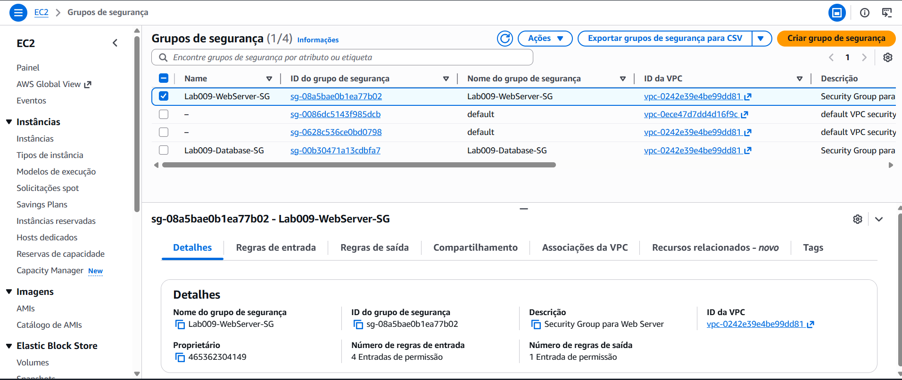
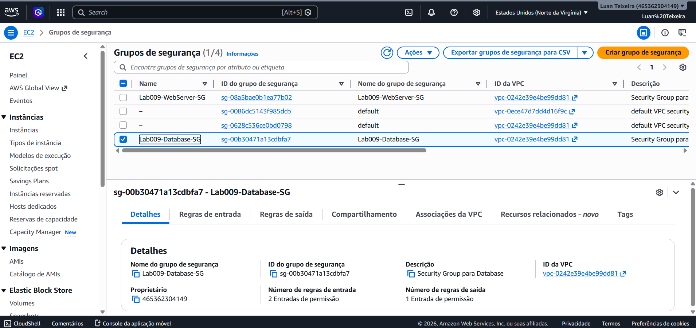
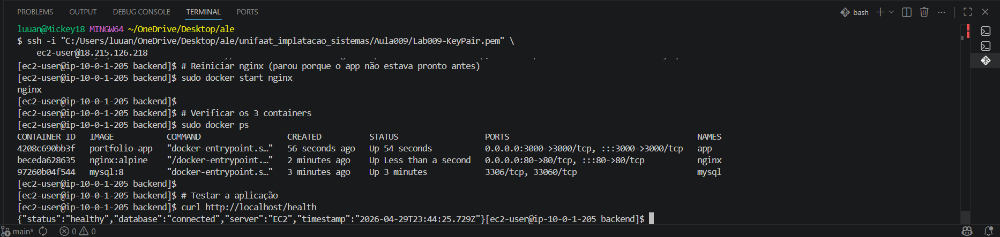
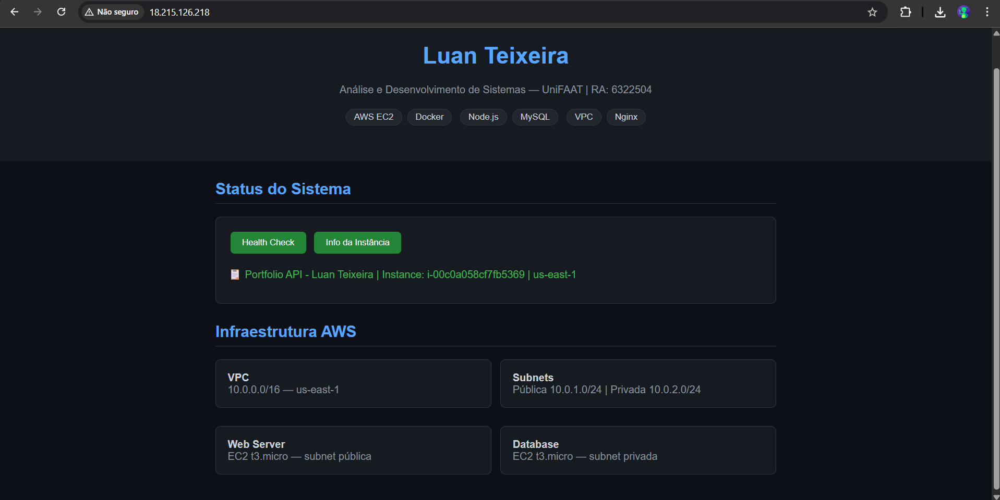
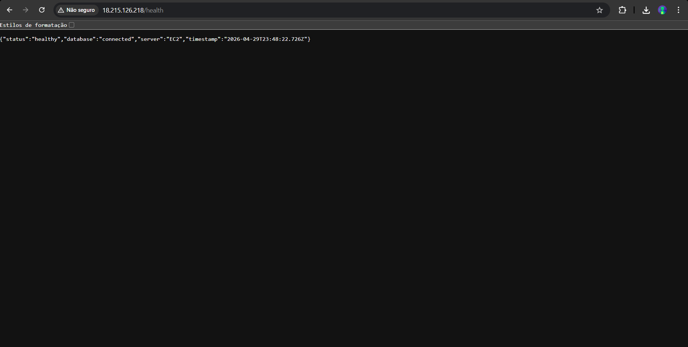

# TF09 - Portfólio Pessoal na AWS

**Aluno:** Luan Teixeira  
**RA:** 6322504  
**Disciplina:** Implementação de Sistemas - UniFAAT  
**Data de entrega:** 06/05/2026

---

## Visão Geral

Sistema de portfólio pessoal hospedado em infraestrutura AWS com EC2, implementando uma arquitetura segura com VPC customizada, Security Groups e boas práticas de segurança de rede.

A aplicação permite cadastrar e visualizar projetos e habilidades técnicas, com backend em Node.js, banco MySQL e frontend servido via Nginx.

---

## Arquitetura

```
Internet
    │
    ▼
[Internet Gateway]
    │
    ▼
┌─────────────────────────────────────────────┐
│ VPC: 10.0.0.0/16  (us-east-1)              │
│                                             │
│  ┌──────────────────────────────────────┐   │
│  │ Subnet Pública: 10.0.1.0/24 (us-east-1a)│
│  │                                      │   │
│  │  ┌──────────────────────┐            │   │
│  │  │ EC2: TF09-WebServer  │            │   │
│  │  │ t3.micro             │            │   │
│  │  │ IP Público: 18.215.126.218        │   │
│  │  │ Nginx (80) + Node.js (3000)       │   │
│  │  └──────────┬───────────┘            │   │
│  └─────────────│────────────────────────┘   │
│                │ MySQL :3306                 │
│  ┌─────────────▼────────────────────────┐   │
│  │ Subnet Privada: 10.0.2.0/24          │   │
│  │                                      │   │
│  │  ┌──────────────────────┐            │   │
│  │  │ EC2: TF09-Database   │            │   │
│  │  │ t3.micro             │            │   │
│  │  │ IP Privado: 10.0.2.51│            │   │
│  │  │ MySQL 3306           │            │   │
│  │  └──────────────────────┘            │   │
│  └──────────────────────────────────────┘   │
└─────────────────────────────────────────────┘
```

---

## Arquitetura de Rede

### VPC Configuration
- **CIDR Block:** 10.0.0.0/16
- **Region:** us-east-1
- **DNS Hostnames:** Habilitado

### Subnets
- **Public Subnet:** 10.0.1.0/24 - us-east-1a (Web Server)
- **Private Subnet:** 10.0.2.0/24 - us-east-1a (Database)

### Routing
- **Public Route Table:** 0.0.0.0/0 → Internet Gateway (igw-04da41a6660b42fa4)
- **Private Route Table:** Apenas tráfego interno da VPC

### Recursos Provisionados
| Recurso | ID | Descrição |
|---|---|---|
| VPC | vpc-0242e39e4be99dd81 | Rede principal |
| Subnet Pública | subnet-0f89540d09edca161 | Web Server |
| Subnet Privada | subnet-06ad98c2c28abfff7 | Database |
| Internet Gateway | igw-04da41a6660b42fa4 | Saída para internet |
| Web Server | i-00c0a058cf7fb5369 | EC2 t3.micro |
| Database | i-0739148564e58be3e | EC2 t3.micro |
| Web SG | sg-08a5bae0b1ea77b02 | Regras do web server |
| DB SG | sg-00b30471a13cdbfa7 | Regras do banco |

---

## Segurança Implementada

### Security Group - Web Server (`sg-08a5bae0b1ea77b02`)
| Porta | Protocolo | Origem | Motivo |
|---|---|---|---|
| 22 | TCP | 138.99.162.75/32 | SSH restrito ao IP do admin |
| 80 | TCP | 0.0.0.0/0 | Acesso HTTP público |
| 443 | TCP | 0.0.0.0/0 | Acesso HTTPS público |
| 3000 | TCP | 0.0.0.0/0 | API Node.js |

### Security Group - Database (`sg-00b30471a13cdbfa7`)
| Porta | Protocolo | Origem | Motivo |
|---|---|---|---|
| 3306 | TCP | sg-08a5bae0b1ea77b02 | MySQL apenas do Web Server |
| 22 | TCP | sg-08a5bae0b1ea77b02 | SSH via bastião (web server) |

**Princípio do menor privilégio:** O banco de dados não possui acesso direto à internet. O SSH no banco só é possível por dentro do web server, funcionando como bastião.

---

## Tecnologias Utilizadas

| Tecnologia | Versão | Justificativa |
|---|---|---|
| Amazon EC2 | t3.micro | Free Tier, suficiente para portfólio |
| Amazon VPC | - | Isolamento de rede e segurança |
| Amazon Linux 2 | - | AMI oficial Amazon, estável |
| Docker | 24.x | Containerização da aplicação |
| Docker Compose | 2.x | Orquestração dos containers |
| Node.js | 18 (Alpine) | Backend leve e performático |
| Express.js | 4.18 | Framework web minimalista |
| MySQL | 8.x | Banco relacional robusto |
| Nginx | Alpine | Proxy reverso e servidor estático |

---

## Como Executar

### Pré-requisitos
- AWS CLI configurado (`aws configure`)
- Bash disponível (Linux/macOS/Git Bash no Windows)

### 1. Criar Infraestrutura
```bash
cd infrastructure/
chmod +x create-infrastructure.sh
./create-infrastructure.sh
```

### 2. Deploy da Aplicação
```bash
# Transferir arquivos para a instância
scp -i TF09-KeyPair.pem -r ../application/ ec2-user@18.215.126.218:~/app/

# Conectar e subir
ssh -i TF09-KeyPair.pem ec2-user@18.215.126.218
cd ~/app
echo "DB_HOST=10.0.2.51" > .env
echo "DB_USER=appuser" >> .env
echo "DB_PASSWORD=SecurePass123!" >> .env
echo "DB_NAME=portfoliodb" >> .env
sudo docker-compose up -d --build
```

### 3. Acessar a Aplicação
```
http://18.215.126.218
```

### 4. Limpeza de Recursos
```bash
cd infrastructure/
chmod +x cleanup-infrastructure.sh
./cleanup-infrastructure.sh
```

---

## Custos Estimados

| Recurso | Tipo | Custo estimado |
|---|---|---|
| EC2 Web Server | t3.micro | Free Tier (750h/mês) |
| EC2 Database | t3.micro | Free Tier (750h/mês) |
| Armazenamento EBS | 8GB gp2 x2 | Free Tier (30GB/mês) |
| Transferência de dados | < 1GB | Free Tier (15GB/mês) |
| **Total estimado** | | **$0,00 (Free Tier)** |

> Monitorar em: AWS Console → Billing → Free Tier Usage

---

## Passos Executados para Implementação

1. Instalação do AWS CLI v2 via MSI
2. Configuração das credenciais AWS (`~/.aws/credentials`)
3. Criação da VPC customizada com CIDR 10.0.0.0/16
4. Habilitação de DNS hostnames na VPC
5. Criação da subnet pública (10.0.1.0/24) com auto-assign de IP público
6. Criação da subnet privada (10.0.2.0/24)
7. Criação e anexação do Internet Gateway
8. Configuração da Route Table com rota 0.0.0.0/0 → IGW
9. Geração do Key Pair SSH (TF09-KeyPair.pem)
10. Criação do Security Group do Web Server com portas 22/80/443/3000
11. Criação do Security Group do Database com acesso restrito ao Web SG
12. Obtenção da AMI mais recente do Amazon Linux 2
13. Lançamento da instância EC2 Web Server na subnet pública
14. Lançamento da instância EC2 Database na subnet privada
15. Aguardando instâncias ficarem no estado `running`
16. Confirmação dos IPs: Web=18.215.126.218 | DB=10.0.2.51

---

## Evidências

### Infraestrutura AWS

**VPC criada**


**Subnet Pública (10.0.1.0/24)**


**Subnet Privada (10.0.2.0/24)**


**Instâncias EC2 running**


### Segurança de Rede

**Security Group - Web Server (portas 22, 80, 443, 3000)**


**Security Group - Database (acesso restrito ao Web SG)**


### Aplicação Funcionando

**Containers rodando + Health Check no terminal**


**Portfólio acessível no browser**


**Health Check via browser (`/health`)**


---

## Documentação Adicional

- [Guia de Deploy](docs/deployment-guide.md)
- [Análise de Segurança](docs/security-analysis.md)
- [Troubleshooting](docs/troubleshooting.md)
