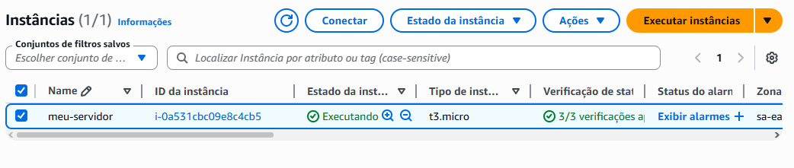
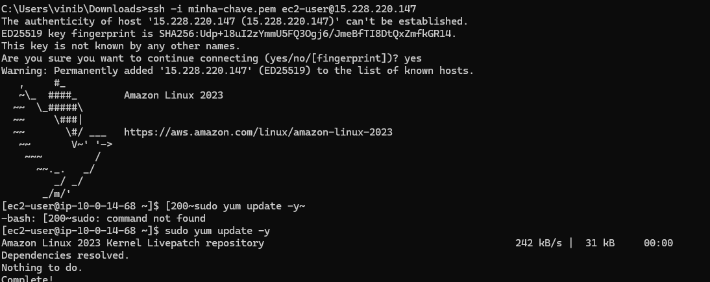
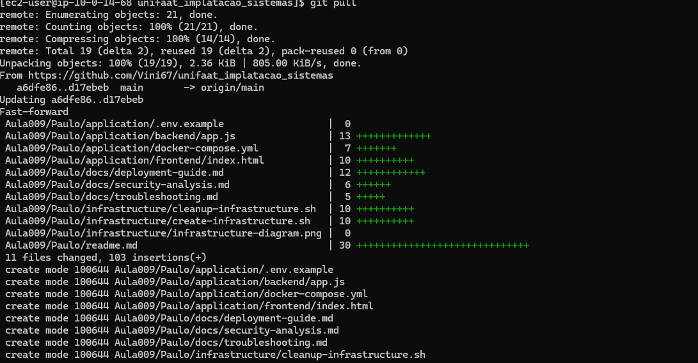
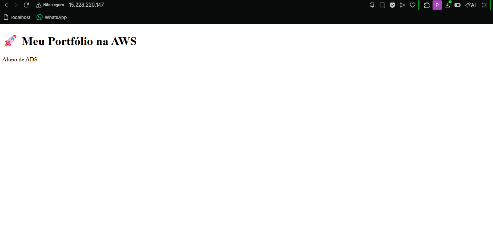

# 🚀 Projeto - Deploy na AWS EC2

Este projeto demonstra a implantação de uma aplicação utilizando uma instância EC2 na AWS, com servidor web Apache e integração com repositório GitHub.

---

## 📌 Objetivo

Realizar o deploy de uma aplicação web em uma instância EC2, permitindo acesso público via navegador.

---

## ☁️ Infraestrutura Utilizada

* AWS EC2 (t3.micro - Free Tier)
* Amazon Linux 2023
* Apache (httpd)
* GitHub

---

## ⚙️ Etapas Realizadas

### 🔹 1. Criação da Instância EC2

* Instância criada na região **sa-east-1 (São Paulo)**
* Tipo: **t3.micro**
* Sistema: **Amazon Linux 2023**

📸


---

### 🔹 2. Configuração de Segurança

Foram liberadas as seguintes portas:

* **22 (SSH)** → acesso remoto (apenas meu IP)
* **80 (HTTP)** → acesso público ao site

---

### 🔹 3. Conexão via SSH

A conexão foi realizada utilizando chave `.pem`:

```bash
ssh -i minha-chave.pem ec2-user@15.228.220.147
```

📸


---

### 🔹 4. Instalação do Servidor Web

```bash
sudo yum update -y
sudo yum install httpd -y
```

```bash
sudo systemctl start httpd
sudo systemctl enable httpd
```

---

### 🔹 5. Clonagem do Repositório

```bash
git clone https://github.com/Vini67/unifaat_implatacao_sistemas.git
```

📸


---

### 🔹 6. Deploy da Aplicação

```bash
cd unifaat_implatacao_sistemas/Aula009/Paulo/application/frontend
sudo cp -r * /var/www/html/
sudo systemctl restart httpd
```

---

### 🔹 7. Acesso ao Site

A aplicação pode ser acessada via navegador:

```
http://15.228.220.147
```

📸


---

## 📂 Estrutura do Projeto

```
Aula009/
└── Paulo/
    ├── application/
    ├── docs/
    │   ├── deployment-guide.md
    │   ├── security-analysis.md
    │   ├── troubleshooting.md
    │   └── images/
    └── infrastructure/
```

---

## ⚠️ Problemas Enfrentados

* Erro de conexão SSH → resolvido ajustando regras de segurança
* Site não carregava → porta 80 não liberada
* Erro no Git clone → resolvido com `--depth 1`

---

## 💰 Custos

O projeto foi executado utilizando o **Free Tier da AWS**, sem custos adicionais.

---

## ✅ Conclusão

A aplicação foi implantada com sucesso na AWS, permitindo acesso público via IP da instância.

---

## 🌐 Acesso

👉 http://15.228.220.147

---

## 👨‍💻 Autor

Paulo Vinicius Bernardes
6324010
