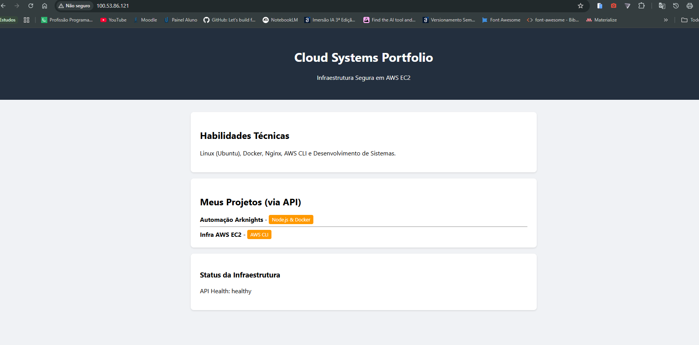
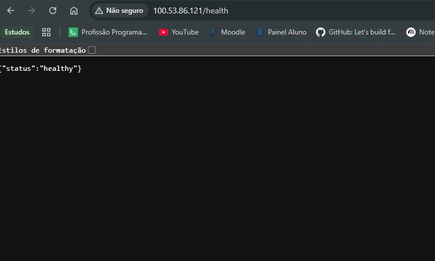
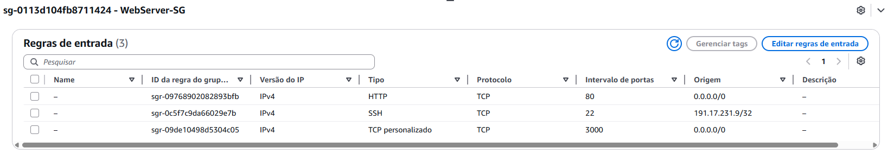
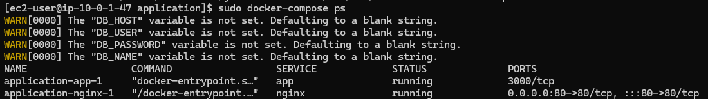

# TF09 - Portfólio Cloud AWS
**Autor:** Giovanna Sabino | **RA:** 6324089

## Descrição do Projeto
Este repositório contém a infraestrutura como código (IaC via shell scripts) e a aplicação containerizada de um portfólio pessoal, implantado na nuvem pública AWS. O projeto comprova o domínio em provisionamento de redes (VPC), configuração de instâncias (EC2), regras de firewall (Security Groups) e orquestração de containers (Docker).

## Evidências de Funcionamento

### 1. Aplicação no Ar (Frontend)
> print da sua aplicação abrindo no navegador com os dados carregados

### 2. Health Check da API
> print da tela `/health` funcionando

### 3. Regras de Segurança (Security Group)
> print das regras Inbound no painel da AWS

### 4. Logs de Deploy (Terminal)
> print do terminal mostrando os containers "Up" após o docker-compose

## Estrutura do Repositório
* `/infrastructure`: Scripts de automação para criar (`create-infrastructure.sh`) e destruir (`cleanup-infrastructure.sh`) a VPC e recursos relacionados, garantindo custo zero ao final do laboratório.
* `/application`: Código-fonte da aplicação, contendo o backend em Node.js, frontend em HTML5/JS e o proxy reverso Nginx, orquestrados via `docker-compose.yml`.
* `/docs`: Análise de segurança, guias de deploy e solução de problemas (troubleshooting).

## Controle de Custos
A arquitetura utiliza recursos inteiramente elegíveis no **AWS Free Tier**, como VPCs, Internet Gateways e instâncias t3.micro. O script interativo de cleanup garante a remoção em cascata dos recursos, evitando cobranças de instâncias ou IPs elásticos ociosos.