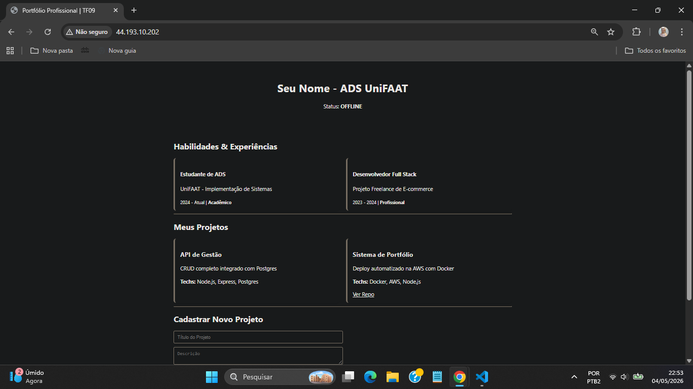
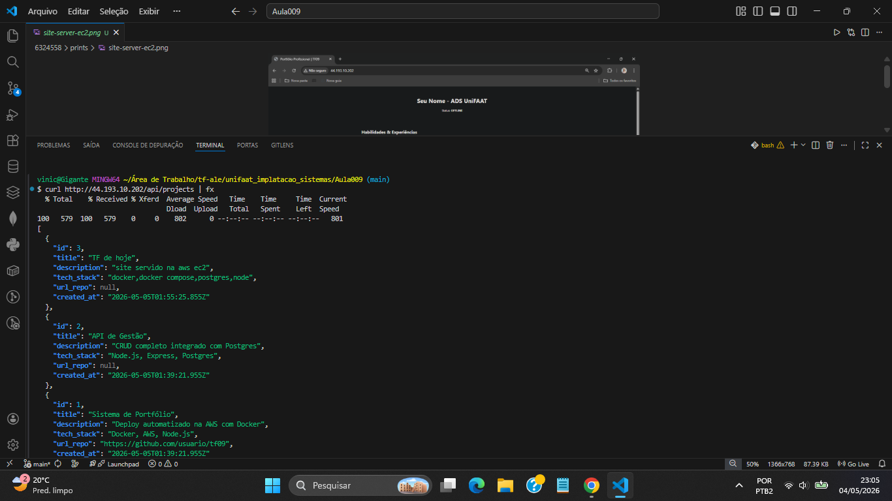
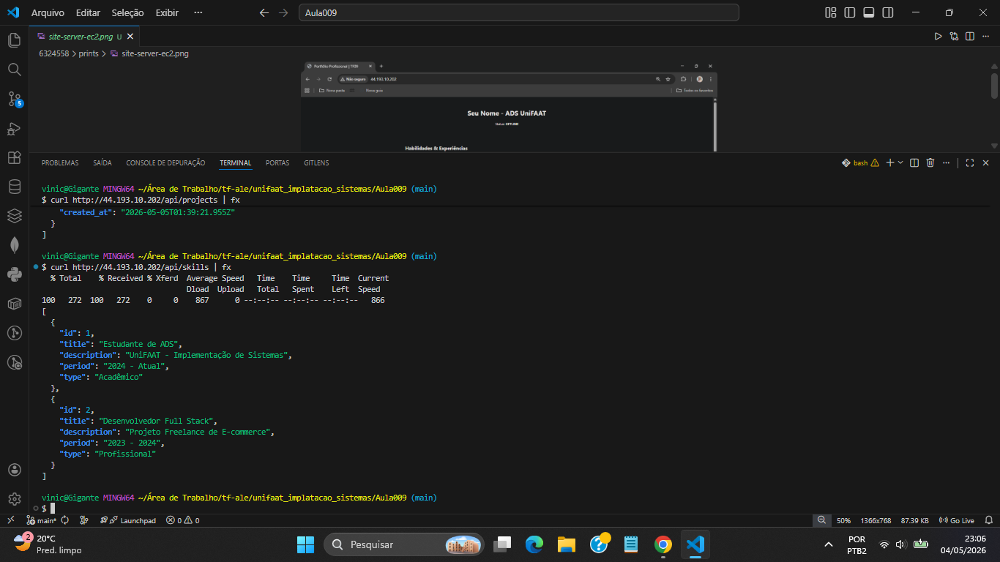
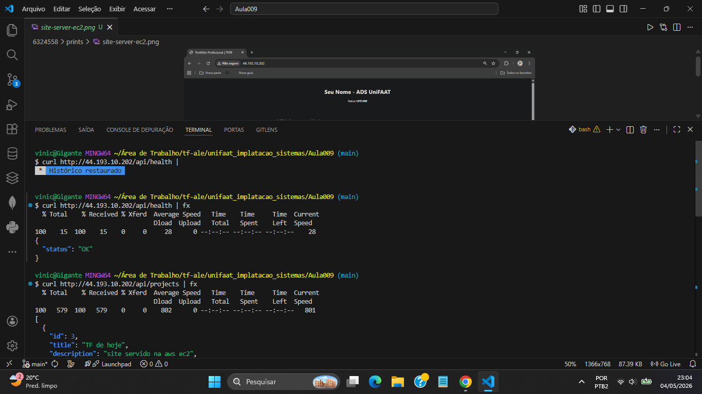

# TF09 - Portfólio Pessoal na AWS

**Aluno:** Vinicius Gigante  
**RA:** 6324558  
**Disciplina:** Implementação de Sistemas - UniFAAT  

---

## Visão Geral

Sistema de portfólio pessoal hospedado em instância EC2 na AWS, com arquitetura containerizada via Docker Compose. A aplicação expõe um frontend em Nginx, uma API REST em Node.js e um banco de dados PostgreSQL, todos isolados em redes Docker separadas.

---

## Arquitetura de Rede

### VPC Configuration
- **CIDR Block:** 10.0.0.0/16
- **Region:** us-east-1

### Subnets
- **Public Subnet:** 10.0.1.0/24 - us-east-1a (Web Server)
- **Private Subnet:** 10.0.2.0/24 - us-east-1a (Database)

### Routing
- **Public Route Table:** 0.0.0.0/0 → Internet Gateway (igw-005dd70cafc248330)
- **Private Route Table:** Sem rota para internet (isolamento do banco)

### Recursos Criados
| Recurso | ID |
|---|---|
| VPC | vpc-0e0334476c46da444 |
| Subnet Pública | subnet-015e25031493f9705 |
| Subnet Privada | subnet-0f784479182b17965 |
| Internet Gateway | igw-005dd70cafc248330 |
| Security Group Web | sg-0670d8d578466813d |
| Instância EC2 | i-043f49b9551d8af0f |
| IP Público | 44.193.10.202 |

---

## Segurança Implementada

### Security Group Web Server
| Porta | Protocolo | Origem | Motivo |
|---|---|---|---|
| 80 | TCP | 0.0.0.0/0 | Acesso público ao portfólio |
| 22 | TCP | 179.125.164.125/32 | SSH restrito ao IP do aluno |

### Isolamento de Rede (Docker)
- Rede `frontend-net`: Nginx ↔ Node.js
- Rede `api-net`: Node.js ↔ PostgreSQL
- O banco de dados **não é acessível** pelo Nginx nem pela internet

### Key Pair
- Chave `tf09-key.pem` gerada via script com permissão `chmod 400`

---

## Evidências da Aplicação Funcionando

### Site na EC2


### Projetos via API


### Habilidades via API


### Health Check


---

## Como Executar

### Pré-requisitos
- AWS CLI instalada e configurada (`aws configure`)
- Git Bash ou terminal Linux/Mac
- Chave de acesso IAM com permissões EC2

### 1. Criar Infraestrutura
```bash
cd infrastructure/
./create-infrastructure.sh
```
O script retorna o IP público da EC2 e o comando SSH.

### 2. Transferir a Aplicação
```bash
scp -i tf09-key.pem -r ../application ec2-user@<IP_EC2>:~/
```

### 3. Conectar na EC2 e Subir a Aplicação
```bash
ssh -i tf09-key.pem ec2-user@<IP_EC2>
cd application/
docker-compose up --build -d
```

### 4. Verificar
```bash
curl http://<IP_EC2>/api/health
curl http://<IP_EC2>/api/projects
curl http://<IP_EC2>/api/skills
```

### 5. Limpar Recursos
```bash
cd infrastructure/
./cleanup-infrastructure.sh
```

---

## Tecnologias Utilizadas

| Tecnologia | Uso |
|---|---|
| AWS EC2 (t3.micro) | Hospedagem da aplicação |
| AWS VPC | Isolamento de rede |
| Docker / Docker Compose | Containerização |
| Nginx | Servidor web e proxy reverso |
| Node.js + Express | API REST |
| PostgreSQL 15 | Banco de dados |
| AWS CLI | Automação da infraestrutura |

---

## Custos Estimados

| Recurso | Custo |
|---|---|
| EC2 t3.micro (Free Tier) | $0,00/mês |
| VPC, Subnets, IGW | $0,00 |
| Transferência de dados (baixo volume) | ~$0,01/mês |
| **Total estimado** | **$0,01/mês** |

> Após avaliação, executar `cleanup-infrastructure.sh` para zerar todos os custos.