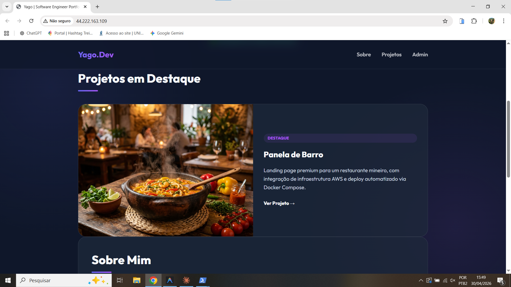
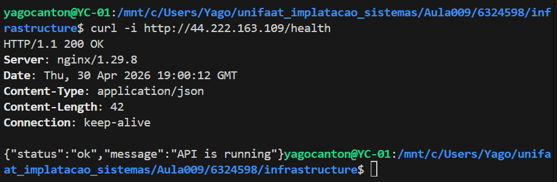
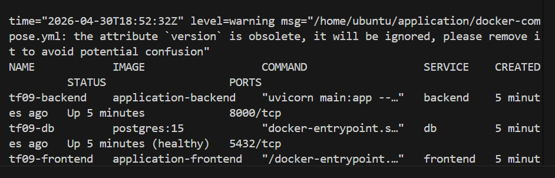
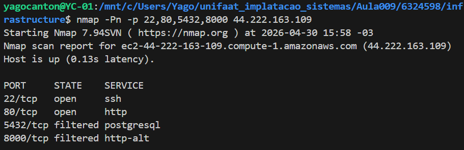

# TF09 - Portfólio Pessoal na AWS

## Informações
Nome: Yago Canton
RA: 6324598

## Visão Geral
Este projeto consiste na implementação de uma infraestrutura completa e automatizada na nuvem AWS para hospedar um Portfólio Pessoal Full Stack. O objetivo é demonstrar competência no provisionamento de recursos de computação (EC2) e rede (VPC, Subnets, Gateways), utilizando as melhores práticas de segurança e isolamento, além de orquestração de containers via Docker Compose.

## Arquitetura de Rede Implementada
A arquitetura segue o modelo multicamadas para garantir segurança e isolamento:
- **VPC**: Rede customizada (`10.0.0.0/16`) isolada.
- **Subnets**: Segregação entre Subnet Pública (`10.0.1.0/24`) para o Web Server e Subnet Privada (`10.0.2.0/24`) para o Database.
- **Security Groups**:
  - `web-sg`: Permite apenas portas 80 (público) e 22 (restrito ao IP do administrador).
  - `db-sg`: Permite apenas porta 5432 vinda do `web-sg`.

## Screenshots da Aplicação
Abaixo estão as evidências visuais do sistema em pleno funcionamento na AWS:


*Legenda: Página principal do portfólio acessível via IP Público.*


*Legenda: Health checks da aplicação.*


*Legenda: Logs do terminal demonstrando o sucesso do provisionamento.*


*Legenda: Segurança de Redes.*

## Passos Executados para Implementação
1. **Desenvolvimento Local**: Criação da aplicação containerizada e validação com Docker Compose.
2. **Automação de Rede**: Escrita do script para criação de VPC, Subnets, Internet Gateway e Tabelas de Rota.
3. **Provisionamento de Computação**: Automação do lançamento da instância EC2 com script de `user-data` para pré-configuração.
4. **Segurança**: Implementação de regras restritivas nos Security Groups e isolamento de banco de dados.
5. **Deployment Automatizado**: Script de orquestração que realiza SCP dos arquivos e inicia os serviços remotamente.

## Como Executar
O processo foi totalmente automatizado para ser executado em poucos passos via terminal (WSL/Linux):

1. **Configuração AWS**: Garanta que o AWS CLI esteja configurado (`aws configure`).
2. **Executar Provisionamento**:
   ```bash
   cd infrastructure
   chmod +x *.sh
   ./create-infrastructure.sh
   ```
3. **Verificação**: Ao final do script, o IP Público da instância será exibido. Acesse-o no navegador para ver o Portfólio.
4. **Limpeza**:
   ```bash
   ./cleanup-infrastructure.sh
   ```

## Tecnologias Utilizadas
- **Nuvem**: AWS (EC2, VPC, Internet Gateway, Route Tables).
- **Infraestrutura como Código (IaC)**: AWS CLI via scripts Bash.
- **Containerização**: Docker e Docker Compose.
- **Backend**: FastAPI (Python) com SQLAlchemy (Assíncrono).
- **Database**: PostgreSQL (Relacional).
- **Frontend**: Nginx servindo HTML5, CSS3 (Vanilla) e JavaScript.

## Segurança Implementada
- **Regras de Entrada (Ingress)**: Porta 22 (SSH) liberada apenas para o IP de quem executa o script (`/32`).
- **Isolamento de Database**: O banco de dados não possui portas expostas para a internet; a comunicação ocorre exclusivamente via rede interna do Docker.
- **Segredos**: Remoção de senhas hardcoded no Docker Compose, utilizando variáveis de ambiente via arquivo `.env`.
- **Privacidade**: VPC customizada com isolamento de subnets.

## Custos Estimados
- **EC2 (t3.micro)**: Elegível para o AWS Free Tier (750 horas/mês gratuitas por 1 ano). Fora do Free Tier, o custo é de aproximadamente $0.0104/hora.
- **IPv4 Público**: A AWS cobra aproximadamente $0.005/hora por IPs públicos em uso.
- **VPC & Rede**: Sem custo associado para os recursos utilizados (VPC, Subnets, SG).
- **Total Estimado**: Próximo a $0.00 para validações dentro do Free Tier. Recomenda-se o cleanup imediato após os testes.

---
*Projeto desenvolvido por Yago (RA: 6324598) - UniFAAT.*
