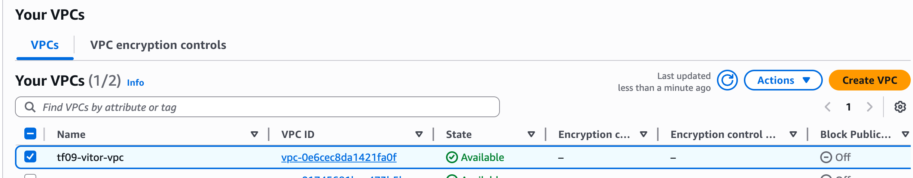
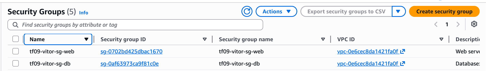
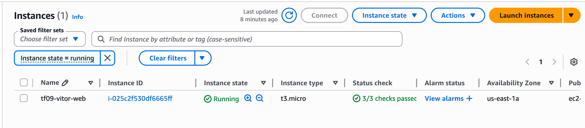
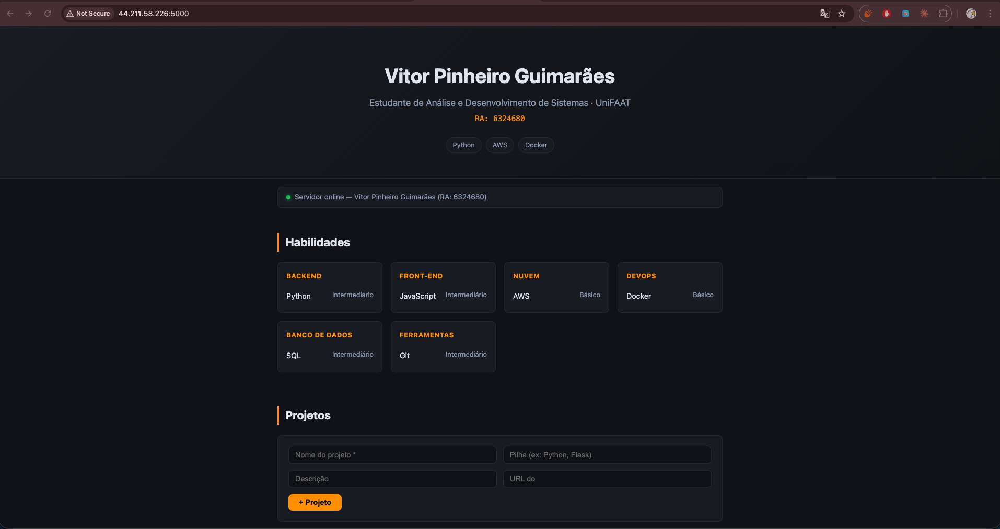
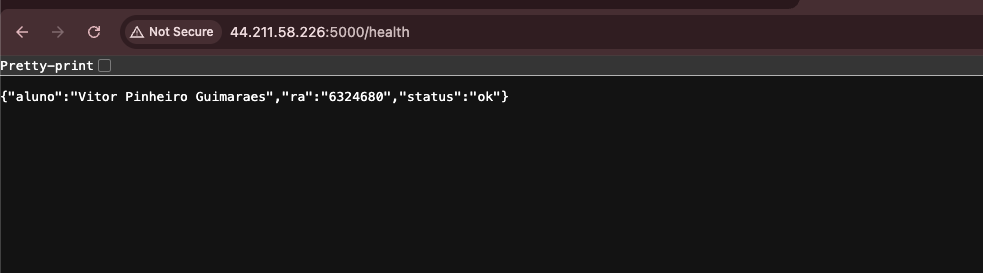

# TF09 - Portfólio Pessoal na AWS

## Aluno
- **Nome:** Vitor Pinheiro Guimaraes
- **RA:** 6324680
- **Disciplina:** Implementação de Sistemas — UniFAAT 2026.1

---

## Visão Geral

Portfólio pessoal hospedado em uma instância **EC2 t3.micro** na AWS, com infraestrutura de rede customizada (VPC, subnets, Security Groups) e aplicação containerizada com Docker.

A aplicação permite listar, adicionar e remover projetos via API REST, além de exibir habilidades técnicas.

---

## Arquitetura de Rede

```
Internet
    │
    ▼
┌─────────────────────────────────────────────┐
│  Internet Gateway (tf09-vitor-igw)          │
└──────────────────┬──────────────────────────┘
                   │
┌──────────────────▼──────────────────────────┐
│  VPC: 10.0.0.0/16  (tf09-vitor-vpc)        │
│                                             │
│  ┌─────────────────┐  ┌─────────────────┐  │
│  │  Subnet Pública │  │ Subnet Privada  │  │
│  │  10.0.1.0/24    │  │ 10.0.2.0/24     │  │
│  │  us-east-1a     │  │ us-east-1b      │  │
│  │                 │  │                 │  │
│  │  [EC2 t3.micro] │  │  [reservada DB] │  │
│  │  sg-web         │  │  sg-db          │  │
│  └─────────────────┘  └─────────────────┘  │
└─────────────────────────────────────────────┘
```

### Configuração de Rede

| Recurso           | Valor            |
|-------------------|------------------|
| VPC CIDR          | 10.0.0.0/16      |
| Subnet Pública    | 10.0.1.0/24 (us-east-1a) |
| Subnet Privada    | 10.0.2.0/24 (us-east-1b) |
| Região            | us-east-1        |

---

## Segurança Implementada

### Security Group — Web Server (sg-web)

| Porta | Protocolo | Origem         | Motivo                        |
|-------|-----------|----------------|-------------------------------|
| 80    | TCP       | 0.0.0.0/0      | HTTP público                  |
| 443   | TCP       | 0.0.0.0/0      | HTTPS público                 |
| 5000  | TCP       | 0.0.0.0/0      | Flask API                     |
| 22    | TCP       | \<MEU_IP\>/32  | SSH restrito ao meu IP        |

### Security Group — Database (sg-db)

| Porta | Protocolo | Origem  | Motivo                          |
|-------|-----------|---------|---------------------------------|
| 5432  | TCP       | sg-web  | Acesso apenas do web server     |

**Princípio aplicado:** menor privilégio — cada SG libera apenas o necessário.

---

## Tecnologias Utilizadas

| Camada         | Tecnologia              | Motivo                              |
|----------------|-------------------------|-------------------------------------|
| Infra          | AWS EC2, VPC, IAM       | Free Tier, conteúdo da disciplina   |
| Containerização| Docker + Compose        | Portabilidade, isolamento           |
| Backend        | Python 3 + Flask        | Leve, simples, amplamente adotado   |
| Banco de Dados | SQLite                  | Zero configuração para demonstração |
| Frontend       | HTML/CSS/JS vanilla     | Sem dependências externas           |

---

## Como Executar

### 1. Criar infraestrutura

```bash
cd infrastructure/
chmod +x create-infrastructure.sh cleanup-infrastructure.sh
./create-infrastructure.sh
```

### 2. Conectar à EC2

```bash
ssh -i ~/.ssh/tf09-vitor-key.pem ec2-user@<IP_PUBLICO>
```

### 3. Subir a aplicação na EC2

```bash
pip3 install flask flask-cors --user
# Copiar arquivos via SCP (do local para EC2) e iniciar:
cd ~/app && nohup python3 app.py > app.log 2>&1 &
```

### 4. Acessar

```
http://44.211.58.226:5000
```

### 5. Limpar após avaliação

```bash
cd infrastructure/
./cleanup-infrastructure.sh
```

---

## Evidências

### Infraestrutura

**VPC e Subnets criadas:**


**Security Groups configurados:**


**Instância EC2 rodando:**


### Aplicação

**Portfólio funcionando no browser (`http://44.211.58.226:5000`):**


**Health check respondendo (`http://44.211.58.226:5000/health`):**


---

## Custos Estimados

| Recurso        | Tipo       | Free Tier | Custo estimado |
|----------------|------------|-----------|----------------|
| EC2 t3.micro   | On-Demand  | 750h/mês  | $0,00          |
| EBS 8 GB gp2   | Storage    | 30 GB/mês | $0,00          |
| VPC            | Networking | Gratuito  | $0,00          |
| Internet GW    | Networking | Gratuito  | $0,00          |
| **Total**      |            |           | **~$0,00**     |

> Recursos criados dentro do Free Tier. Limpar imediatamente após a avaliação.

---

## Referências

- [Lab009.md](../Lab009.md)
- [TA009.md](../TA009.md)
- [AWS EC2 User Guide](https://docs.aws.amazon.com/ec2/)
- [AWS VPC User Guide](https://docs.aws.amazon.com/vpc/)
