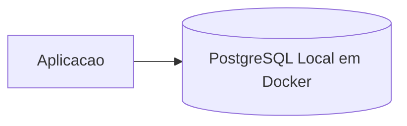
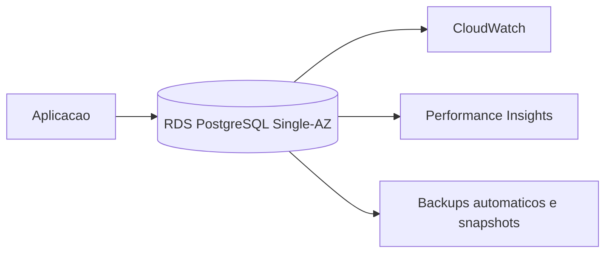
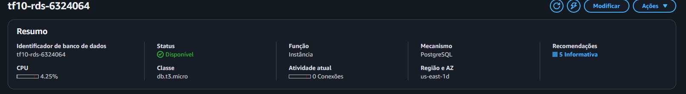
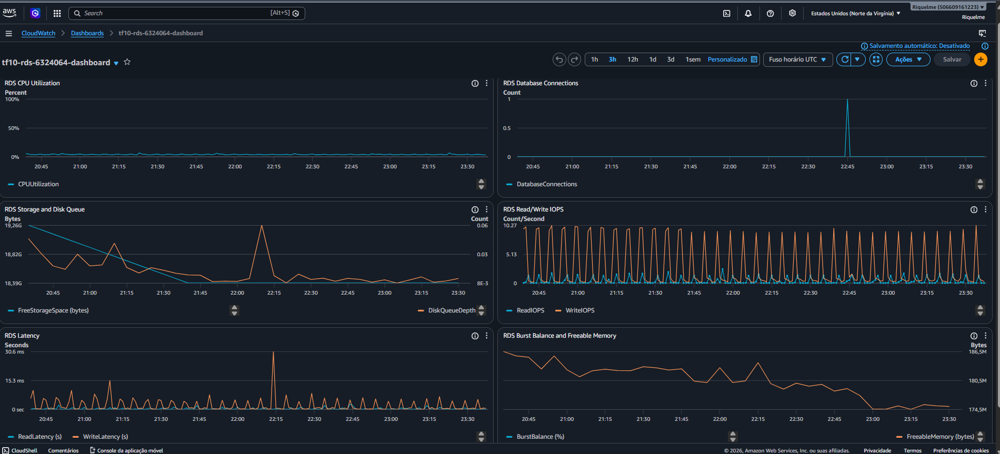
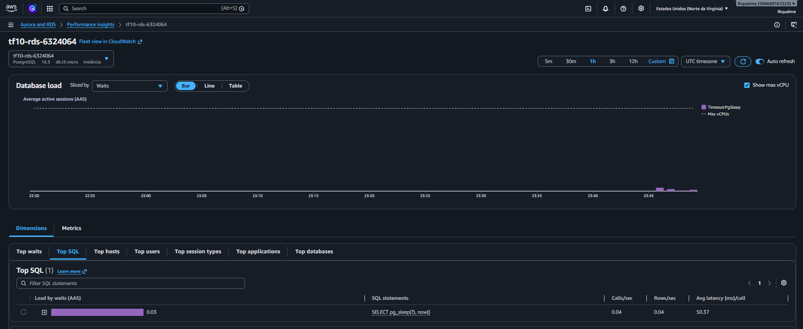

# TF10 - Migracao para Amazon RDS

## Visao Geral
Este trabalho documenta a migracao de um banco PostgreSQL local (executando em Docker) para Amazon RDS PostgreSQL, com foco em disponibilidade, backup, monitoramento, seguranca e comparacao de custos/performance.

Aluno: Riquelme Menezes
RA: 6324064
Disciplina: Implementacao de Sistemas
Curso: Analise e Desenvolvimento de Sistemas - UniFAAT

## Arquitetura
### Antes


### Depois


## Como Executar a Migracao
Pre-requisitos:
- AWS CLI autenticada (`aws configure`)
- Cliente PostgreSQL instalado (`pg_dump`, `psql`)
- Permissao IAM para RDS, CloudWatch e SNS

Passo a passo:
1. Copie o arquivo de ambiente:
   - `cp .env.example .env`
2. Ajuste as variaveis no `.env` (credenciais, subnet group, security group, etc.).
3. Crie a instancia RDS:
   - `bash migration/create-rds.sh`
4. Migre schema e dados:
   - `bash migration/migrate-data.sh`
5. Valide integridade da migracao:
   - `bash migration/validate-migration.sh`
6. Configure dashboard e alarmes:
   - `monitoring/cloudwatch-dashboard.json`
   - `monitoring/alerts-config.json`
7. Limpe os recursos ao final da avaliacao:
   - `bash migration/cleanup.sh`

## Resultados Obtidos
Resumo dos resultados apos execucao (benchmark sintetico `SELECT 1` com `pgbench`, 10s, 5 conexoes):
- Tempo medio de query local: 0.092 ms
- Tempo medio de query no RDS: 135.153 ms
- Throughput local: 54096.25 queries/sec
- Throughput RDS: 36.99 queries/sec
- Disponibilidade local: 99.00% (estimativa sem HA)
- Disponibilidade RDS: 99.90% (Single-AZ no laboratorio)

## Custos e ROI
Resumo financeiro (detalhado em `docs/cost-analysis.md`):
- Custo local mensal estimado: $32.00
- Custo RDS mensal estimado (Single-AZ): $14.70
- Diferenca: -$17.30
- Avaliacao de ROI: positivo em custo e reducao de esforco operacional

## Evidencias de Funcionamento
Capturas de tela obrigatorias:
- Console RDS com instancia criada
- Dashboard CloudWatch com metricas
- Performance Insights com dados

Capturas adicionadas (arquivos):





Logs obrigatorios:
- Saida dos scripts em `migration/`
- Relatorio de validacao gerado pelo `validate-migration.sh` (anexado no PR)
- Resultados de benchmark e consultas em `monitoring/performance-queries.sql`

## Estrutura de Entrega
```text
Aula010/
└── 6324064/
    ├── README.md
    ├── .env.example
    ├── migration/
    │   ├── create-rds.sh
    │   ├── migrate-data.sh
    │   ├── validate-migration.sh
    │   └── cleanup.sh
    ├── monitoring/
    │   ├── cloudwatch-dashboard.json
    │   ├── alerts-config.json
    │   └── performance-queries.sql
    └── docs/
      ├── evidencias/
      │   ├── 01-rds-instancia-disponivel.png
      │   ├── 02-cloudwatch-dashboard.png
      │   ├── 03-performance-insights-top-sql.png
      │   └── README.md
        ├── migration-plan.md
        ├── performance-analysis.md
        ├── cost-analysis.md
        └── troubleshooting.md
```
