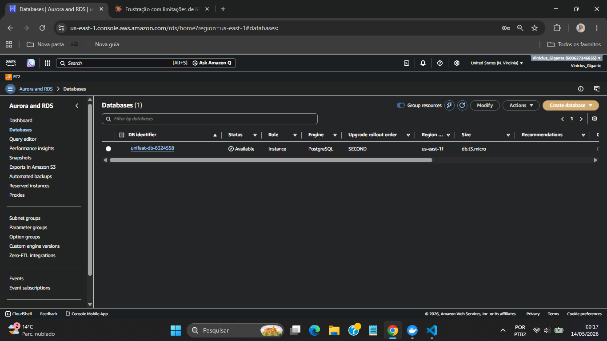
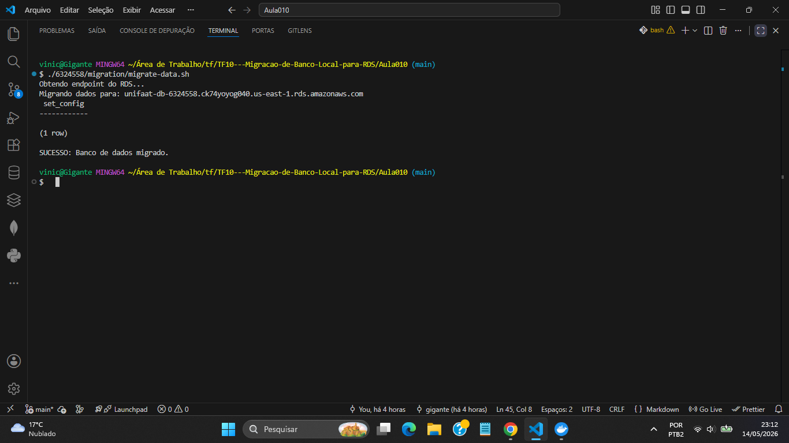
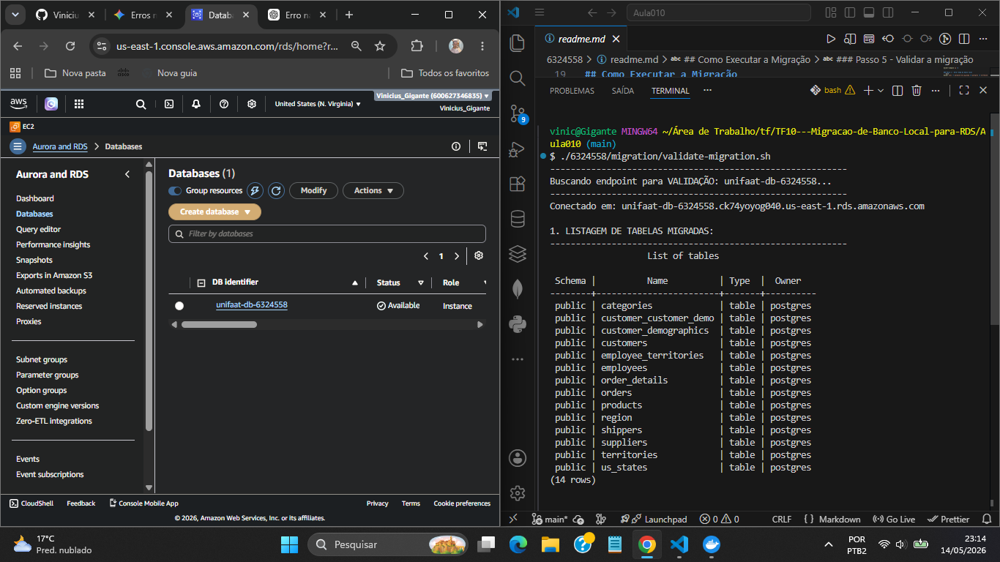
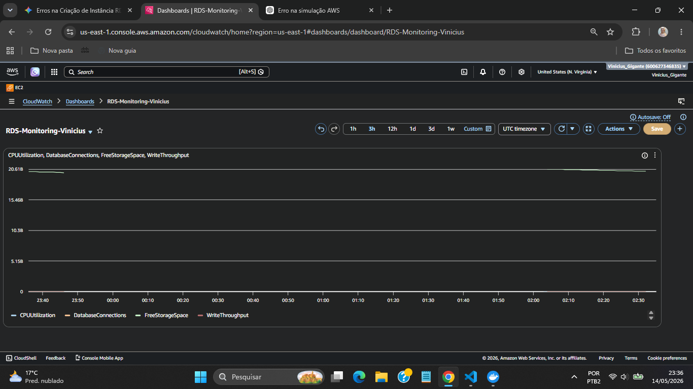
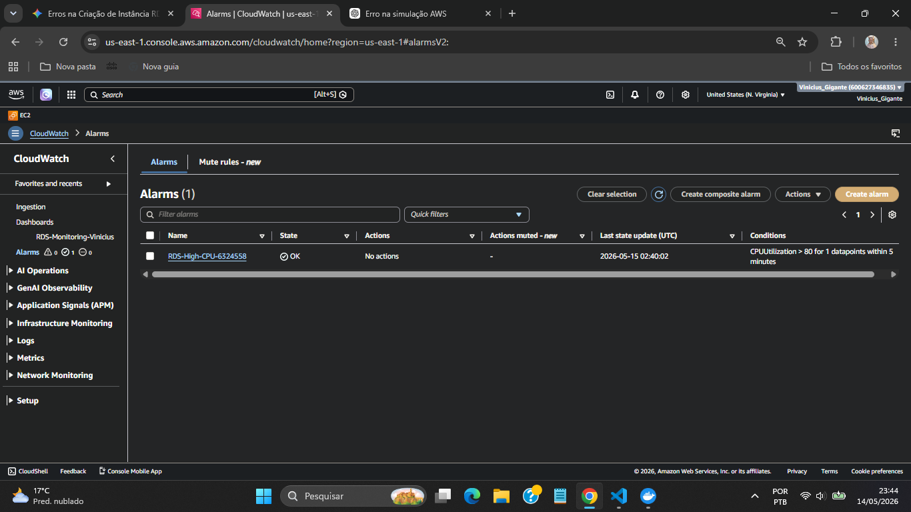

## Pré-requisitos

### Ferramentas necessárias
- **AWS CLI** — [https://aws.amazon.com/cli/](https://aws.amazon.com/cli/)
- **Docker Desktop** — [https://www.docker.com/products/docker-desktop/](https://www.docker.com/products/docker-desktop/)
- **PostgreSQL Client (psql)** — [https://www.enterprisedb.com/downloads/postgres-postgresql-downloads](https://www.enterprisedb.com/downloads/postgres-postgresql-downloads)
  - Na instalação, marcar apenas **Command Line Tools**
  - Após instalar, adicionar ao PATH no Git Bash:
```bash
    export PATH=$PATH:"/c/Program Files/PostgreSQL/18/bin"
```

### Configuração da AWS CLI
```bash
aws configure
```
Informe: Access Key, Secret Key, região `us-east-1` e formato `json`.

### Altere o nome do arquivo de variáveis de ambiente
```bash
mv ./6324558/.env.example ./6324558/.env
```


## Como Executar a Migração

> Execute todos os comandos a partir da pasta `Aula010/`


### Passo 1 - Subir banco local
```bash
docker-compose up -d
```


### Passo 2 - Gerar dump do banco local
```bash
docker exec -t postgres-erp pg_dump -U postgres -d northwind -F p > 6324558/migration/northwind_backup.sql
```


### Passo 3 - Criar instância RDS
```bash
./6324558/migration/create-rds.sh
```
Aguarde o status ficar **Available** no Console AWS antes de prosseguir.
- ****


### Passo 4 - Migrar os dados
```bash
./6324558/migration/migrate-data.sh
```
-****


### Passo 5 - Validar a migração
```bash
./6324558/migration/validate-migration.sh
```
-****


### Dashboard CloudWatch:
-****


### Passo 6 - Criar Alerta
```bash
./6324558/migration/create-alerts.sh
```
- ****


### Passo 7 - Limpeza (após avaliação)
```bash
./6324558/migration/cleanup.sh
```