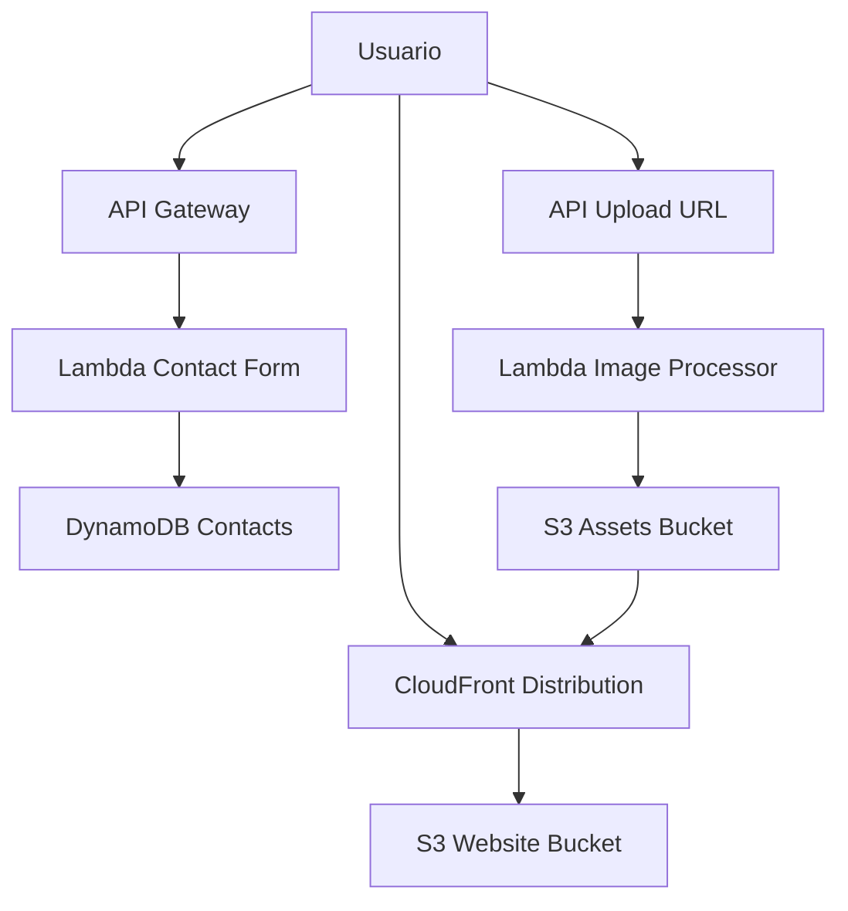

# TF11 - Portfolio S3 e CloudFront

Aluno: Riquelme Menezes  
RA: 6324064  
Disciplina: Implementacao de Sistemas  
Curso: Analise e Desenvolvimento de Sistemas - UniFAAT

## Visao Geral
Entrega pratica da Aula 011 com hospedagem estatica em S3, distribuicao via CloudFront, observabilidade no CloudWatch e documentacao tecnica.

## URLs em Producao
- Website S3: http://tf11-6324064-site-20260609144018.s3-website-us-east-1.amazonaws.com
- Website CloudFront: https://d1iufybby9ovf9.cloudfront.net
- API de contato: https://36v8ggdhk7.execute-api.us-east-1.amazonaws.com/prod/contact
- API de upload: https://36v8ggdhk7.execute-api.us-east-1.amazonaws.com/prod/upload

## Status de Conformidade (TF11)
| Bloco do enunciado | Status | Evidencias |
|---|---|---|
| S3 Static Website Hosting (0,5) | Concluido | docs/evidencias/01-s3-website-config.json, docs/evidencias/02-s3-bucket-policy.json |
| CloudFront e Performance (0,5) | Concluido | docs/evidencias/03-cloudfront-distribution.json, docs/evidencias/06-cache-hit-rate.json, docs/evidencias/07-performance-check.txt |
| Funcionalidades avancadas (0,3) | Concluido | docs/deployment-output.txt (API/Lambda provisionadas) |
| Seguranca e Monitoramento (0,2) | Concluido | docs/evidencias/04-cloudwatch-alarms.json, docs/evidencias/05-cloudwatch-dashboard.json |

## Arquitetura

Diagrama PNG: docs/architecture-diagram.png

## O que ja esta implementado
- Website completo com paginas obrigatorias: index, projetos, experiencia, contato e error
- Design responsivo, SEO basico, assets minificados e imagens WebP
- Buckets S3 (website e assets) com versionamento e lifecycle
- CloudFront com redirect para HTTPS, compressao e cache policy gerenciada
- API Gateway com rotas /contact e /upload
- Lambdas de contato, upload e processamento de imagem provisionadas
- Trigger S3 uploads/raw -> Lambda image-processor ativo
- Logging de acesso S3 e logging CloudFront
- Alarmes e dashboard CloudWatch
- Evidencias tecnicas exportadas em JSON/TXT na pasta docs/evidencias

## Resultado final do deploy serverless
Provisionamento concluido com sucesso pelo script infrastructure/deploy-missing-windows.ps1.

Recursos confirmados:
- API_GATEWAY_ID: 36v8ggdhk7
- LAMBDA_CONTACT: tf11-6324064-contact-form
- LAMBDA_UPLOAD: tf11-6324064-upload-url
- LAMBDA_IMAGE: tf11-6324064-image-processor
- CONTACT_API_URL: https://36v8ggdhk7.execute-api.us-east-1.amazonaws.com/prod/contact
- UPLOAD_API_URL: https://36v8ggdhk7.execute-api.us-east-1.amazonaws.com/prod/upload

## Scripts principais
- infrastructure/create-buckets.sh
- infrastructure/configure-policies.sh
- infrastructure/setup-cloudfront.sh
- infrastructure/deploy-observability-windows.ps1
- infrastructure/deploy-missing-windows.ps1
- infrastructure/generate-architecture-png.ps1

## Evidencias geradas
- docs/evidencias/01-s3-website-config.json
- docs/evidencias/02-s3-bucket-policy.json
- docs/evidencias/03-cloudfront-distribution.json
- docs/evidencias/04-cloudwatch-alarms.json
- docs/evidencias/05-cloudwatch-dashboard.json
- docs/evidencias/06-cache-hit-rate.json
- docs/evidencias/07-performance-check.txt

## Documentacao tecnica
- docs/performance-report.md
- docs/security-analysis.md
- docs/cost-analysis.md
