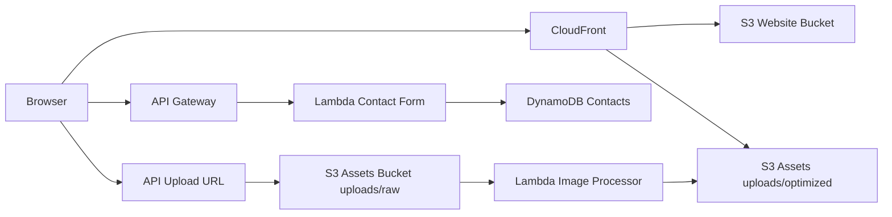

# Architecture Diagram - TF11

## Fluxo principal

## Decisoes tecnicas
- S3 website bucket separado do bucket de assets para reduzir risco de exposicao indevida.
- CloudFront na frente do website para HTTPS obrigatorio e cache global.
- Lambda de imagem desacoplada por evento S3 para reduzir acoplamento no frontend.
- Formulario persistido em DynamoDB para simplicidade operacional e escala.

## Pontos de validacao
- CloudFront com `ViewerProtocolPolicy=redirect-to-https`
- Bucket website com policy de leitura publica apenas em objetos
- Bucket assets privado com CORS configuravel por origem
- Versionamento habilitado em ambos os buckets
