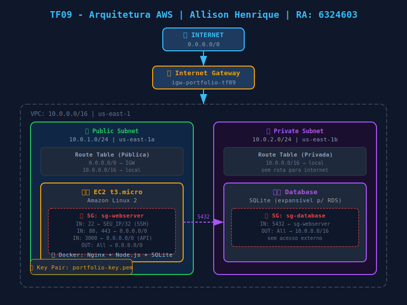

# TF09 - Portfólio Pessoal na AWS

**Aluno:** Allison Henrique da Silva Oliveira  
**RA:** 6324603  
**Disciplina:** Implementação de Sistemas  
**Curso:** Análise e Desenvolvimento de Sistemas - UniFAAT  

---

## Visão Geral

Projeto de portfólio pessoal hospedado na AWS, demonstrando habilidades em infraestrutura de nuvem com EC2, VPC customizada, Security Groups e boas práticas de segurança de rede.

A aplicação é composta por:
- **Frontend** responsivo com informações pessoais, projetos e habilidades
- **API REST** para gerenciar projetos (CRUD completo)
- **Banco de dados** SQLite para armazenamento dos projetos
- **Infraestrutura AWS** com VPC, subnets, Security Groups e EC2

---

## Arquitetura de Rede

```
Internet
    │
    ▼
Internet Gateway (igw-portfolio-tf09)
    │
    ▼
┌─────────────────────────────────────────────┐
│  VPC: 10.0.0.0/16  │  Região: us-east-1     │
│                                             │
│  ┌──────────────────────────────────────┐   │
│  │  Subnet Pública: 10.0.1.0/24        │   │
│  │  AZ: us-east-1a                     │   │
│  │                                     │   │
│  │  ┌─────────────────────────────┐    │   │
│  │  │  EC2 t3.micro               │    │   │
│  │  │  Amazon Linux 2             │    │   │
│  │  │  Docker: Nginx + Node.js    │    │   │
│  │  │  SG: sg-webserver           │    │   │
│  │  └─────────────────────────────┘    │   │
│  └──────────────────────────────────────┘   │
│                                             │
│  ┌──────────────────────────────────────┐   │
│  │  Subnet Privada: 10.0.2.0/24        │   │
│  │  AZ: us-east-1b                     │   │
│  │  (sem rota para internet)           │   │
│  │                                     │   │
│  │  ┌─────────────────────────────┐    │   │
│  │  │  Database (SQLite/RDS)      │    │   │
│  │  │  SG: sg-database            │    │   │
│  │  └─────────────────────────────┘    │   │
│  └──────────────────────────────────────┘   │
└─────────────────────────────────────────────┘
```

### VPC Configuration
- CIDR Block: `10.0.0.0/16`
- Region: `us-east-1`

### Subnets
- Public Subnet: `10.0.1.0/24` - `us-east-1a`
- Private Subnet: `10.0.2.0/24` - `us-east-1b`

### Routing
- Public Route Table: `0.0.0.0/0 → Internet Gateway` | `10.0.0.0/16 → local`
- Private Route Table: `10.0.0.0/16 → local` (sem saída para internet)

---

## Segurança Implementada

### Security Group - Web Server (sg-webserver)
| Tipo     | Protocolo | Porta | Origem       | Motivo                        |
|----------|-----------|-------|--------------|-------------------------------|
| Inbound  | TCP       | 22    | SEU_IP/32    | SSH restrito ao administrador |
| Inbound  | TCP       | 80    | 0.0.0.0/0    | HTTP público                  |
| Inbound  | TCP       | 443   | 0.0.0.0/0    | HTTPS público                 |
| Inbound  | TCP       | 3000  | 0.0.0.0/0    | API backend                   |
| Outbound | All       | All   | 0.0.0.0/0    | Saída livre                   |

### Security Group - Database (sg-database)
| Tipo     | Protocolo | Porta | Origem       | Motivo                        |
|----------|-----------|-------|--------------|-------------------------------|
| Inbound  | TCP       | 5432  | sg-webserver | Apenas web server acessa o DB |
| Outbound | All       | All   | 10.0.0.0/16  | Apenas tráfego interno        |

### SSH Key Management
- Key Pair RSA gerado via AWS CLI (`portfolio-key.pem`)
- Chave privada com permissão `chmod 400` (somente leitura pelo dono)
- Acesso SSH liberado apenas para o IP público do administrador (`/32`)
- Chave privada protegida no `.gitignore` — nunca commitada

---

## Tecnologias Utilizadas

| Tecnologia        | Justificativa                                    |
|-------------------|--------------------------------------------------|
| AWS EC2 t3.micro  | Free Tier, suficiente para portfólio             |
| AWS VPC           | Isolamento de rede e controle de tráfego         |
| Amazon Linux 2    | AMI oficial AWS, leve e segura                   |
| Node.js + Express | Leve e rápido para APIs REST                     |
| SQLite            | Sem custo adicional, ideal para portfólio        |
| Docker            | Portabilidade e facilidade de deploy             |
| Nginx             | Proxy reverso e servidor de arquivos estáticos   |
| HTML/CSS/JS       | Frontend sem dependências externas               |

---

## Como Executar

### Opção A — Localmente com Docker (recomendado para testes)

**Pré-requisitos:** Docker instalado

```bash
# 1. Entrar na pasta da aplicação
cd application/

# 2. Subir os containers
docker-compose up -d --build

# 3. Acessar no navegador
# Frontend:      http://localhost:9000
# API Health:    http://localhost:4000/api/health
# API Projetos:  http://localhost:4000/api/projects

# 4. Ver logs
docker-compose logs -f

# 5. Parar os containers
docker-compose down
```

### Opção B — Deploy na AWS com EC2

**Pré-requisitos:** AWS CLI configurado (`aws configure`), Git Bash ou WSL

```bash
# 1. Criar toda a infraestrutura AWS
cd infrastructure/
chmod +x create-infrastructure.sh
./create-infrastructure.sh
# O script exibe o IP público da EC2 ao final

# 2. Copiar aplicação para a EC2
source infrastructure-ids.env
scp -i portfolio-key.pem -r ../application/ ec2-user@$PUBLIC_IP:~/app/

# 3. Acessar a EC2 via SSH
ssh -i portfolio-key.pem ec2-user@$PUBLIC_IP

# 4. Na EC2 — subir a aplicação
cd ~/app
cp .env.example .env
docker-compose up -d

# 5. Verificar funcionamento
curl http://$PUBLIC_IP/api/health
curl http://$PUBLIC_IP/api/projects

# 6. Acessar no navegador
# http://<IP_PUBLICO_EC2>
```

### Limpeza de Recursos AWS (evitar custos)
```bash
cd infrastructure/
./cleanup-infrastructure.sh
```

---

## Endpoints da API

| Método | Endpoint            | Descrição                  |
|--------|---------------------|----------------------------|
| GET    | /api/health         | Health check da aplicação  |
| GET    | /api/projects       | Listar todos os projetos   |
| POST   | /api/projects       | Criar novo projeto         |
| PUT    | /api/projects/:id   | Atualizar projeto          |
| DELETE | /api/projects/:id   | Remover projeto            |

---

## Custos Estimados

| Recurso          | Tipo          | Custo Mensal     |
|------------------|---------------|------------------|
| EC2 t3.micro     | Free Tier     | $0,00 (750h/mês) |
| VPC              | Gratuito      | $0,00            |
| Internet Gateway | Transferência | ~$0,09/GB saída  |
| Elastic IP       | Em uso        | $0,00            |
| **Total**        |               | **~$0 - $1,00**  |

> Usando Free Tier (12 meses) na região us-east-1. Após Free Tier: ~$8,50/mês.

---

## Passos Executados

1. Criação da VPC `10.0.0.0/16` na região `us-east-1`
2. Criação de subnet pública `10.0.1.0/24` em `us-east-1a`
3. Criação de subnet privada `10.0.2.0/24` em `us-east-1b`
4. Criação e associação do Internet Gateway
5. Configuração das Route Tables (pública e privada)
6. Criação dos Security Groups com princípio do menor privilégio
7. Geração do Key Pair `portfolio-key`
8. Lançamento da instância EC2 t3.micro com Amazon Linux 2
9. Deploy da aplicação via Docker Compose (Nginx + Node.js + SQLite)
10. Validação de health checks e conectividade

---

## Diagrama de Infraestrutura



---

## Screenshots

| Screenshot | Descrição |
|------------|-----------|
|  | Página do portfólio rodando |
|  | API health check respondendo |
|  | API retornando projetos |
|  | Containers rodando no Docker |

---

## Estrutura do Projeto

```
6324603/
├── README.md
├── .gitignore
├── infrastructure/
│   ├── create-infrastructure.sh     ← Cria VPC, subnets, SGs, EC2
│   ├── cleanup-infrastructure.sh    ← Remove todos os recursos AWS
│   ├── user-data.sh                 ← Configura Docker na EC2
│   └── infrastructure-diagram.svg  ← Diagrama da arquitetura
├── application/
│   ├── frontend/
│   │   └── index.html               ← Portfólio responsivo
│   ├── backend/
│   │   ├── server.js                ← API REST Node.js + Express
│   │   ├── package.json
│   │   └── Dockerfile
│   ├── docker-compose.yml           ← Orquestra backend + frontend
│   ├── nginx.conf                   ← Proxy reverso
│   └── .env.example
└── docs/
    ├── deployment-guide.md          ← Passo a passo de deploy
    ├── security-analysis.md         ← Análise de segurança
    ├── troubleshooting.md           ← Solução de problemas
    └── screenshots/                 ← Evidências de funcionamento
```
